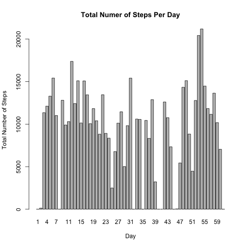
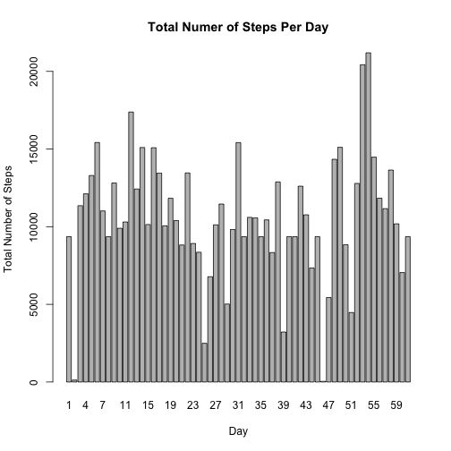
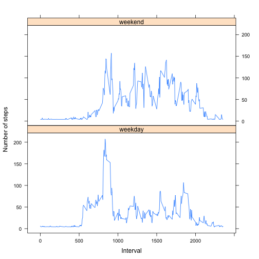

Peer Assessment 1 by Allan Chen
===============================
          
First, we are going to load the data into R.


```r
ds <- read.csv("activity.csv")
```
      
  
## Part I

To make the data more accessible for our analysis, we are going to introduce a new column to the data, called "day".


```r
day <- rep(1:61, each = 288)
pds <- cbind(day = day, ds)
```

So now, the data looks something like this:


```r
head(pds)
```

```
##   day steps       date interval
## 1   1    NA 2012-10-01        0
## 2   1    NA 2012-10-01        5
## 3   1    NA 2012-10-01       10
## 4   1    NA 2012-10-01       15
## 5   1    NA 2012-10-01       20
## 6   1    NA 2012-10-01       25
```

```r
tail(pds)
```

```
##       day steps       date interval
## 17563  61    NA 2012-11-30     2330
## 17564  61    NA 2012-11-30     2335
## 17565  61    NA 2012-11-30     2340
## 17566  61    NA 2012-11-30     2345
## 17567  61    NA 2012-11-30     2350
## 17568  61    NA 2012-11-30     2355
```

Now that the data is much easier to subset, we can calculate the total number of steps taken per day, ignoring all of the missing values. 


```r
totalsteps.list <- c()
for(i in 1:61) {
        pdsi <- subset(pds, day == i)
        totalsteps <- sum(pdsi$steps, na.rm = TRUE)
        totalsteps.list <- c(totalsteps.list, totalsteps)
}
```

Using the base plotting system, we can make a **histogram** of the total number of steps taken each day. 
Note that based on how we processed the data, Day 1 is October 1st, 2012 and Day 61 is November 30, 2012.


```r
barplot(totalsteps.list, names.arg=1:61, main = "Total Numer of Steps Per Day", ylab = "Total Number of Steps", xlab = "Day")
```

 

We can also calculate the **mean** and **median total number of steps taken per day**. 


```r
mean <- mean(totalsteps.list)
median <- median(totalsteps.list)
```

The **mean total number of steps taken per day** is 9354.2295.    
The **median total number of steps taken per day** is 10395.             

## Part II

To make a **time-series plot** of the average number of steps taken for a given interval, we are going to use the loop function. 

For each iteration, we are going to subset the data based on the "interval" column. Then, with each subset, we are going to calculate the average number of steps taken and add the value to the "averagesteps.list" vector. 


```r
averagesteps.list <- c()
for(i in ds$interval[1:288]) {
        ds.int <- subset(ds, interval == i)
        averagesteps <- mean(ds.int$steps, na.rm = TRUE)
        averagesteps.list <- c(averagesteps.list, averagesteps)
}
```

Then, we are going to construct a new data frame with two columns: "interval" and "averagesteps"


```r
new.ds <- data.frame(interval = ds$interval[1:288], averagesteps = averagesteps.list)
```

The resulting data frame looks something like this:

```r
head(new.ds)
```

```
##   interval averagesteps
## 1        0      1.71698
## 2        5      0.33962
## 3       10      0.13208
## 4       15      0.15094
## 5       20      0.07547
## 6       25      2.09434
```

```r
tail(new.ds)
```

```
##     interval averagesteps
## 283     2330       2.6038
## 284     2335       4.6981
## 285     2340       3.3019
## 286     2345       0.6415
## 287     2350       0.2264
## 288     2355       1.0755
```

Now, we can visualize the result by plotting it using the base plotting system.


```r
plot(averagesteps ~ interval, new.ds, type = "l", main = "Time-Series Plot of the Average Number of Steps Taken", xlab = "Interval", ylab = "Average Steps")
```

 

Furthermore, we can find which 5-minute interval contains the **maximum number of steps**.


```r
max <- new.ds$interval[which.max(new.ds[,2])]
```
  
The **maximum number of steps** is in the 5-minute interval: 835. 

## Part III

### Question 1 

We can calculate the **total number of missing values** by:


```r
sum <- sum(is.na(ds[,1]))
```

The result is: 2304. 

### Question 2

The plan is that we are going to **replace all of the missing values** with the *mean total number of steps taken per interval*. The steps are:

1. Calculate the mean total number of steps taken per day.

2.Divide the mean total number of steps taken per day by the number of intervals per day. 

3.Then, we are going to identify the missing values in the data and replace them with the calculated value in *2*. 

4.We have now created a data with all of the missing values filled in. 

### Question 3 

Previously, we calculated the mean total number of steps taken per day to be: 


```r
mean(totalsteps.list)
```

```
## [1] 9354
```

There are 288 intervals per day, so the *mean total number of steps taken per interval* is: 


```r
mean(totalsteps.list) / 288
```

```
## [1] 32.48
```


We can **replace all of the missing values** with our choice of value 32.48 by: 


```r
ds[is.na(ds)] <- 32.48
```

Now, our data looks something like this: 


```r
head(ds)
```

```
##   steps       date interval
## 1 32.48 2012-10-01        0
## 2 32.48 2012-10-01        5
## 3 32.48 2012-10-01       10
## 4 32.48 2012-10-01       15
## 5 32.48 2012-10-01       20
## 6 32.48 2012-10-01       25
```

```r
tail(ds)
```

```
##       steps       date interval
## 17563 32.48 2012-11-30     2330
## 17564 32.48 2012-11-30     2335
## 17565 32.48 2012-11-30     2340
## 17566 32.48 2012-11-30     2345
## 17567 32.48 2012-11-30     2350
## 17568 32.48 2012-11-30     2355
```

### Question 4

Before we start, we are going to introduce a column, called "day".


```r
day <- rep(1:61, each = 288)
pds <- cbind(day = day, ds)
```

Exactly like what we did in ***Part I***, we can calculate the total number of steps taken per day by:


```r
totalsteps.list <- c()
for(i in 1:61) {
        pdsi <- subset(pds, day == i)
        totalsteps <- sum(pdsi$steps, na.rm = TRUE)
        totalsteps.list <- c(totalsteps.list, totalsteps)
}
```

Using the base plotting system, we can make a **histogram** of the total number of steps taken each day. 
Note that based on how we processed the data, Day 1 is October 1st, 2012 and Day 61 is November 30, 2012.


```r
barplot(totalsteps.list, names.arg=1:61, main = "Total Numer of Steps Per Day", ylab = "Total Number of Steps", xlab = "Day")
```

 

Finally, we calculate the **mean** and **median total number of steps taken per day**. 


```r
mean(totalsteps.list)
```

```
## [1] 10581
```

```r
median(totalsteps.list)
```

```
## [1] 10395
```

The impact of imputing missing data instead of ignoring it is that the mean total number of steps taken per day is now slightly larger (*9354.23* versus *10581*).

## Part IV

For this part, we are going to use the data that we have constructed in ***Part III***.

In order to make a **time-series plot for weekdays versus weekends**, we need to first convert the "date" column to the class "Date". Then, we are going to add a column, called "wdwe", which is a factor variable embeeded inside an *ifelse function*. Lastly, we are going to insert the "wdwe" column into the data. 


```r
ds$date <- as.Date(ds$date, format = "%Y-%m-%d")
ds$wdwe<- as.factor(ifelse(weekdays(ds$date) %in% c("Saturday", "Sunday"), "Weekend", "Weekday"))
```

Now, the data looks something like this:

```r
head(ds)
```

```
##   steps       date interval    wdwe
## 1 32.48 2012-10-01        0 Weekday
## 2 32.48 2012-10-01        5 Weekday
## 3 32.48 2012-10-01       10 Weekday
## 4 32.48 2012-10-01       15 Weekday
## 5 32.48 2012-10-01       20 Weekday
## 6 32.48 2012-10-01       25 Weekday
```

```r
tail(ds)
```

```
##       steps       date interval    wdwe
## 17563 32.48 2012-11-30     2330 Weekday
## 17564 32.48 2012-11-30     2335 Weekday
## 17565 32.48 2012-11-30     2340 Weekday
## 17566 32.48 2012-11-30     2345 Weekday
## 17567 32.48 2012-11-30     2350 Weekday
## 17568 32.48 2012-11-30     2355 Weekday
```

Then, we are going to calculate the average number of steps taken per 5-minute interval, averaged over all weekday days. 


```r
averagesteps.list1 <- c()
for(i in ds$interval[1:288]) {
        ds.int1<- subset(ds, interval == i & wdwe == "Weekday")
        averagesteps1 <- mean(ds.int1$steps)
        averagesteps.list1 <- c(averagesteps.list1, averagesteps1) 
}
```

We are going to do the same for all weekend days. 


```r
averagesteps.list2 <- c()
for(i in ds$interval[1:288]) {
        ds.int2<- subset(ds, interval == i & wdwe == "Weekend")
        averagesteps2 <- mean(ds.int2$steps)
        averagesteps.list2 <- c(averagesteps.list2, averagesteps2) 
}
```

Then, we are going to combine the two results.


```r
steps <- c(averagesteps.list1, averagesteps.list2)
```

We also need to create new "interval" and "wdwe" columns. 


```r
interval <- c(ds$interval[1:288], ds$interval[1:288])
wdwe <- c(rep("weekday", 288), rep("weekend", 288))
```

Now we have all the components, we can create a new data.


```r
new.ds <- data.frame(interval = interval, steps = steps, wdwe = wdwe)
```

The new data looks something like this:

```r
head(new.ds)
```

```
##   interval steps    wdwe
## 1        0 6.353 weekday
## 2        5 4.731 weekday
## 3       10 4.486 weekday
## 4       15 4.508 weekday
## 5       20 4.420 weekday
## 6       25 5.642 weekday
```

```r
tail(new.ds)
```

```
##     interval  steps    wdwe
## 571     2330  5.122 weekend
## 572     2335 15.060 weekend
## 573     2340  9.935 weekend
## 574     2345  5.685 weekend
## 575     2350  4.060 weekend
## 576     2355  4.060 weekend
```

Finally, we can construct the **multi-panel time-series plot** using the lattice plotting system. 


```r
library(lattice)
xyplot(steps ~ interval | wdwe, data = new.ds, layout = c(1,2), type = "l", xlab = "Interval", ylab = "Number of steps")
```

 

Thank you for assessing my assignment! 
